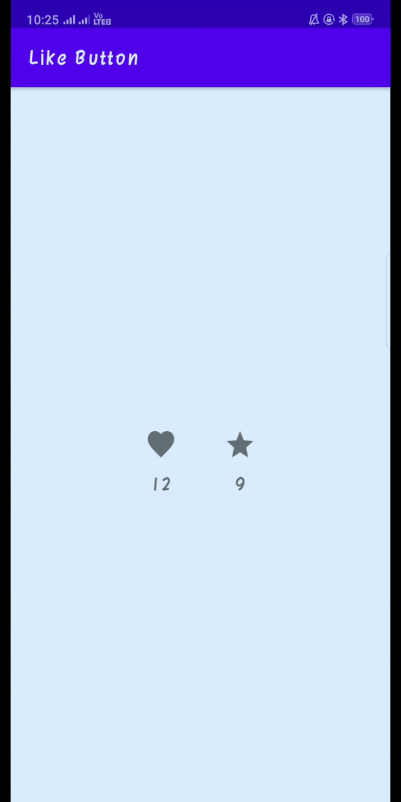

# Like button package | android | kotlin

instagram type like button with animation.

# Preview

# Dependencies

1. Add this to your settings.gradle

        allprojects {
            repositories {
                ...
                maven { url "https://jitpack.io" }
            }
        }

1. Add this to your module's build.gradle

        implementation 'com.github.jd-alexander:LikeButton:0.2.3'
    
    

	
# XML uses

        <com.like.LikeButton
        android:id="@+id/lbLike"
        android:layout_width="wrap_content"
        android:layout_height="wrap_content"
        android:layout_centerInParent="true"
        app:icon_size="25dp"
        app:icon_type="heart" />

## XML Details

| Properties  | Information |
| ------------- | ------------- |
| app:icon_size  | use to set size of icon |
| app:icon_type  | use to set type of icon eg. star, heart, thumb, etc. |
| app:liked  | set the inital liked state of the button |
| app:is_enabled  |  set if the button is to be enabled or disabled |
| app:like_drawable  |  to use custom icons instead of the ones bundled with the library for like button |
| app:unlike_drawable  |  to use custom icons instead of the ones bundled with the library for unlike button |
| app:circle_start_color  |  to change color of center start ring |
| app:circle_end_color  |  to change color of center end ring |
| app:dots_primary_color  |  to change primary color of outer animation dots|
| app:dots_secondary_color  | to change secondary color of outer animation dots |
| app:anim_scale_factor  | change size of dots and overall animation |

# Activity uses
Binding view with id :

        lbLike = findViewById(R.id.lbLike)
    
Setting Click Listener on button :        

        lbLike.setOnLikeListener(
            object : OnLikeListener {
                override fun liked(likeButton: LikeButton?) {
                    likeCount += 1
                    txtCount.text = likeCount.toString()
                }

                override fun unLiked(likeButton: LikeButton?) {
                    println("Unliked")
                }
            }
        )
        
# Methods

| Method | Description |  
| :-------- | :------- | 
| `findViewById` | `Binding view with corresponding to id` |  
| `setOnLikeListener` | `set click Listeners on corresponding button` |

# Inspired From

 - [jd-alexander](https://github.com/jd-alexander/LikeButton)

# Author

- [@Jayesh Shinde](https://github.com/jayesh2272001)
